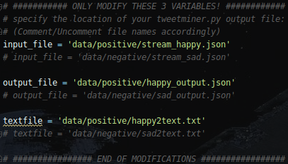
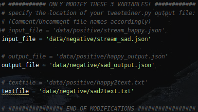
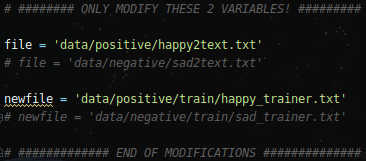
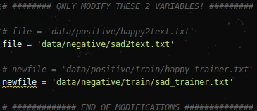

# Sentiment Analysis
**Text pre-processing, and sentiment analysis using datasets captured from Twitter live stream.**  
:sunglasses:  
Currently, this tool will produce 2 text files:  
The *first* file will contain tweets with a generally **positive** sentiment, such as "I am happy".  
The *second* file will contain tweets with a generally **negative** sentiment, like "I am sad".  
> These files will be used to train a machine learning algorithm.  
>The goal is to assist Artificial Intelligence(AI) development by leveraging sentimental analysis to determine if a
> human's statement has a positive or negative feeling.
---

#### CONTENTS:  
* **Mining Tool** - For collecting tweets from the Twitter live-stream.  The real-time raw data is stored in .json
 format.  
* **Pre-processing Module** - Extracts the actual tweet text from the raw data.  This module also removes:  
  * tweets not in English
  * non-ascii characters
  * hyperlinks
  * stopwords based on the Natural Language Toolkit (NLTK)  
  
* **Cleaner Module** - Formats the results into a .txt file and removes blank lines, leading whitespace, etc.

---
#### PREREQ:  
To capture live stream data, an app must be registered with https://apps.twitter.com and an active Twitter account.  
Once an app is registered and approved (approval usually takes around a day or so), a series of credentials to
 interact with the Twitter API will be generated.  
 
 These credentials (4 total, labeled as the variables below) will need to be placed into a file called config.py.  So
  create a new file in the project root directory called "config.py".  
  ```
sentiment_analysis/
    |---data/
    |---misc/
    |---prep/
    |    |---cleaner.py
    |    |---preprocess.py
    |    └---pyTweetCleaner.py
    |
    |---config.py    <-- CREATE THIS FILE
    |---README.md
    |---requirements.txt
    └---tweetminer.py
```
  The contents of this file should look like this:  
  ```python
consumer_key = 'your_consumer_key'
consumer_secret = 'your_consumer_key'
access_token = 'your_access_token'
access_secret = 'your_access_secret'
```
(Obviously your actual consumer/access data will need to be placed in their proper spot ***within*** the single
 quotes)  
<br></br>  

---  
#### INSTRUCTIONS FOR USING THIS TOOL:  
(The following commands only apply to Linux systems, but will also work in Windows with the Git Bash or Cmder terminal
 installed.)
 1. Ensure python3, and virtualenv (venv) is installed on your system.  
 **Note**: Python has included virtualenv in the standard library since version 3.3.  
 
 2. Clone or download this project:  
$ <code>git clone ht<k>tps</k>://github.com/jcdavenport/sentiment_analysis.git</code>   
$ <code>cd sentiment_analysis</code>
 
 3. Create/activate a venv that uses python3, and install requirements.txt  
 $ <code>virtualenv -p /usr/bin/python3 venv</code>  
 $ <code>source venv/bin/activate</code>&nbsp;&nbsp;&nbsp;(use <code>deactivate</code> when you're done using this
  tool)  
 (venv)$ <code>pip install -r requirements.txt</code>  
 <b>!! Make sure the "config.py" file has been created as mentioned in the PREREQ !!</b>  
 
 4. Start harvesting raw tweet data from the live Twitter stream:  
 (venv)$ <code>python tweetminer.py -q happy</code>  
 The "-q" option specifies a specific query or filter for the tweets being collected. Let this run for a few minutes
 , then press "**CTRL+C**" to stop execution.
 In this example, the live Twitter stream is accessed and only tweets matching the query "happy" will be collected.  
 A file will be automatically created to store the raw .json data, located here:  
 "data/positive/stream_happy.json"  
 
 5. Run the preprocess and cleaner tools to sanitize the raw data:  
 (Try running in PyCharm if you get errors executing in terminal)  
 (venv)$ <code>python prep/preprocess.py</code>  
 (venv)$ <code>python prep/cleaner.py</code>  
 (venv)$ <code>head data/positive/train/happy_trainer.txt</code>  
 **note**:  The last command shows just a sample of the cleaned data.  
 
 6. Repeat steps 4 and 5 with a query of "sad"  
 (venv)$ <code>python tweetminer.py -q sad</code>  
 Here, the live Twitter stream is accessed and only tweets matching the query "sad" will be collected.  
 A file will be automatically created to store the raw .json data, located here:  
 "data/negative/stream_sad.json"  
 <br></br>    
 **IMPORTANT** - Before re-running the commands from step 5, view the source code for "preprocess
 .py" and "cleaner.py" and make the following changes:  
 <br></br>  
 * **prep/preprocess.py**  
    
 change to:  
   
 <br></br>  
 * **prep/cleaner.py**  
    
 change to:  
   
 <br></br>  
 Now run: 
 (Try running in PyCharm if you get errors executing in terminal)   
 (venv)$ <code>python prep/preprocess.py</code>  
 (venv)$ <code>python prep/cleaner.py</code>  
 (venv)$ <code>head data/negative/train/sad_trainer.txt</code>  
 **note**:  The last command shows just a sample of the cleaned data.  
 <br></br>  
 **Run <code>deactivate</code> to exit your virtual environment and return to your default interpreter.**  
 <br></br>
 The 2 files that have been cleaned can now be used as training files for a sentiment analysis machine learning
  system.  The purpose is to train AI to tell the difference between positive and negative sentiments people may have
   on a particular subject.  
    
 <br></br>
   
##### *This is a work in progress.  I am developing methods to simplify the current process, and to implement the actual machine learning algorithm.  

Still Needed:  
 -> Create branches for different versions  
 -> Refactor source code so no user interaction is required beyond initial execution, i.e. text processing will
  automatically run in sequence after the data miner has finished.  
 -> Allow user to enter a limit value to specify the amount of data to collect.  CTRL+C can be used to stop collection
   if a data limit is not specified.  
<br></br>
---    
#### VERSIONS:  


 
<br></br>